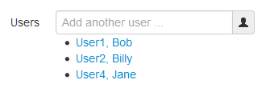

## Introduction

This is a [Symfony v2.2+](http://symfony.com/) Bundle that provides a 
[Bootstrap](http://twitter.github.com/bootstrap/) **(v2.x or v3.x)**
[Typeahead](http://twitter.github.com/bootstrap/javascript.html#typeahead) widget for use in forms. 
The Typeahead component used in this bundle is the original Bootstrap v2.3 Typeahead library with a few enhancements.

**Update: If you were pointing to `dev-master` in your composer.json and this bundle stopped working change your version to
"^1.x" and run `composer update lifo/typeahead` to update your project.**
 
* If you are using **Bootstrap v2.x** then you must use version **[1.x](https://github.com/lifo101/typeahead-bundle/tree/1.1)**
of this bundle.
* If you are using **Bootstrap v3.x** then you must use version **[2.x](https://github.com/lifo101/typeahead-bundle/tree/2.0)**
of this bundle.

*Note: This bundle does not use the newer [Twitter/Typeahead.js](https://twitter.github.io/typeahead.js/) javascript library.*

### Enhanced Typeahead Features

This bundle adds a few enhancements to the original bootstrap typeahead javascript library: 

* Supports JSON objects
* Caches results
* Delays AJAX request to reduce server requests
* Properly handles pasting via mouse
* Includes an `AJAX Loader` icon

### Screenshots

This example shows a form field that allows a single name to be entered.


This example shows a form field that allows multiple names to be entered. Clicking on a name link removes the entity. 
The entity in the backend is actually an ArrayCollection and automatically allows adding/removing entities from the list.



## How to install

**Note:** *This bundle requires jQuery and Bootstrap to be installed in your environment but does not include them 
directly.* I suggest using the [braincrafted/bootstrap-bundle](https://github.com/braincrafted/bootstrap-bundle) 
which can help with this for you. 

* Add `lifo/typeahead-bundle` to the "requires" section of your project's `composer.json` file, which can be done 
automatically by running the composer command from within your project directory:

    ```
    composer require lifo/typeahead-bundle
    ```
    
    or manually by editing the composer.json file: 
    
    ```javascript
    {
        // ...
        "require": {
            // ...
            "lifo/typeahead-bundle": "^2.0"
        }
    }
    ```

* Run `composer update lifo/typeahead-bundle` in your project root.
* Update your project `app/AppKernel.php` file and add this bundle to the $bundles array:

  ```php
  $bundles = array(
      // ...
      new Lifo\TypeaheadBundle\LifoTypeaheadBundle(),
  );
  ```

* Add `@lifo_typeahead_js` to your Assetic `javascripts` block. Similar to the block below. 
Your actual setup may differ. Be sure to include it AFTER your jquery and bootstrap libraries.

  ```twig
      
          <script src="{{ asset_url }}"></script>
      
  ```

* Add `@lifo_typeahead_css` to your Assetic `stylesheets` block. Similar to the block below. 
Your actual setup may differ. 

  ```twig
      
      <link href="{{ asset_url }}" type="text/css" rel="stylesheet" />
      
  ```

## How to use

Using the typeahead control is extremely simple. The available options are outlined below:

```php
$builder->add('user', 'entity_typeahead', array(
    'class' => 'MyBundle:User',
    'render' => 'username',
    'route' => 'user_list',
));
```

* **Required Options**
    * `class` is your entity class.
    * `render` is the property of your entity to display in the autocomplete menu.
    * `route` is the name of the route to fetch entities from. The controller matching the route will receive the 
    following parameters via `POST`:
        * `query` The query string to filter results by.
        * `limit` The maximum number of results to return.
* **Optional Options**
    * `route_params` Extra parameters to pass to the `route`.
    * `minLength` Minimum characters needed before firing AJAX request.
    * `items` Maximum items to display at once *(default: 8)*
    * `delay` Delay in milliseconds before firing AJAX *(default: 250)*
    * `spinner` Class string to use for loading spinner *(default: "glyphicon glyphicon-refresh spin")*
    *  `multiple` If true the widget will allow multiple entities to be selected. One at a time. This special mode creates 
    an unordered list below the typeahead widget to display the selected entities.
    * `callback` Callback function (or string) that is called when an item is selected. Prototype: `function(text, data)` 
    where `text` is the label of the selected item and `data` is the JSON object returned by the server.

### AJAX Response
The controller should return a `JSON` array in the following format. Note: `id` and `value` properties are required and 
you may include any other properties that can potentially be used within the template.

```javascript
[
  { id: 1, value: 'Displayed Text 1' },
  { id: 2, value: 'Displayed Text 2' }
]
```

### Template

Your form template might look something like this _(The screenshots above used this template bit)_.
**Note:** The `widget_addon` attribute is a `mopa/bootstrap-bundle` attribute.

```twig
{{ form_row(form.name) }}
{{ form_row(form.owner, { attr: { placeholder: 'Search for user ...'}, widget_addon: {type: 'append', 'icon': 'user'}}) }}
{{ form_row(form.users, { attr: { placeholder: 'Add another user ...'}, widget_addon: {type: 'append', 'icon': 'user'}}) }}
```

## Notes

This bundle renders its form elements in standard Symfony style. You will have to override the form blocks to get the 
proper Bootstrap styles applied. I strongly suggest something like 
[braincrafted/bootstrap-bundle](https://github.com/braincrafted/bootstrap-bundle) that will override the symfony form 
templates with proper Bootstrap versions automatically for you.
